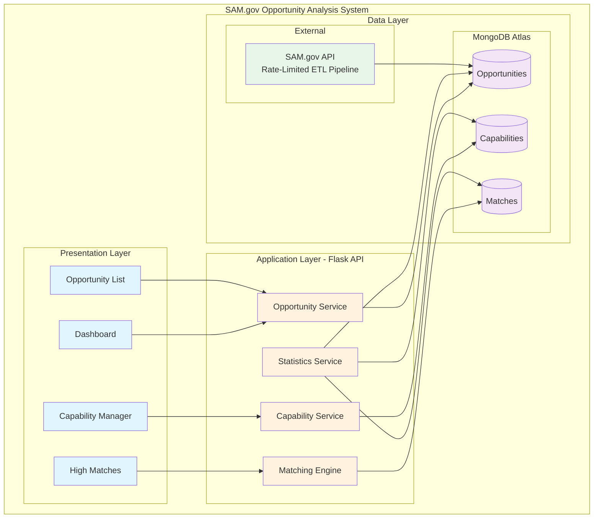
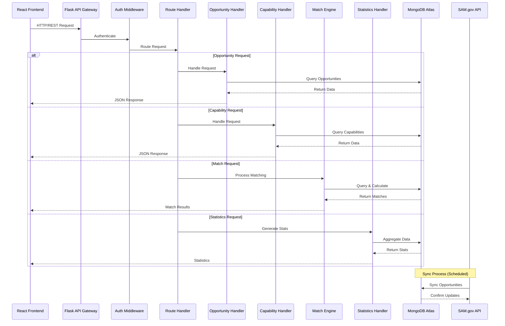
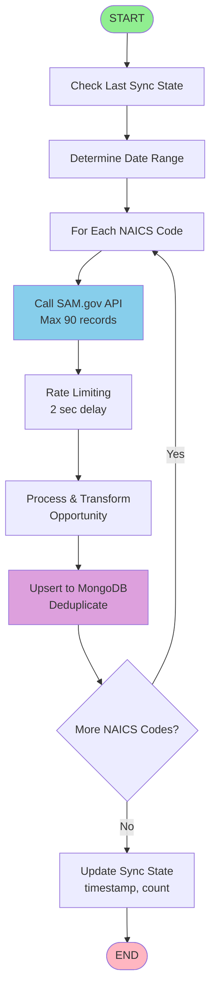
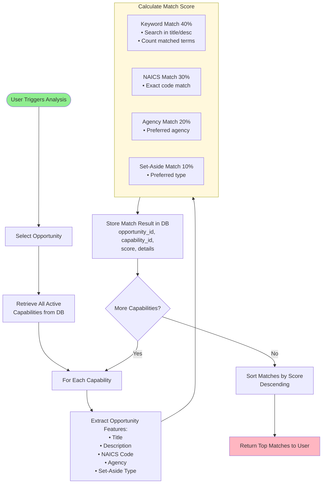
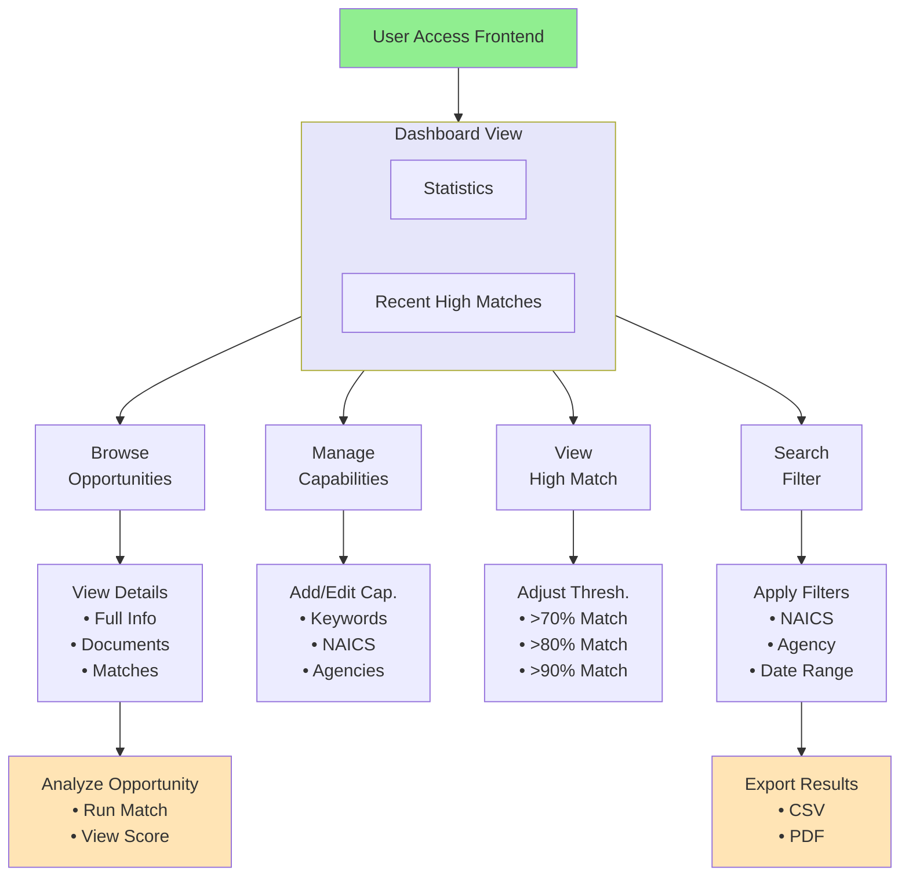
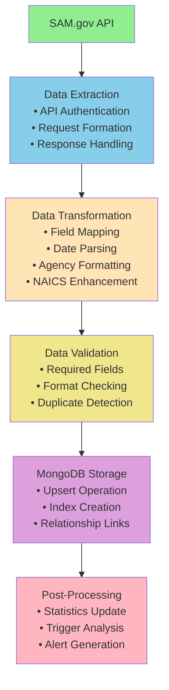
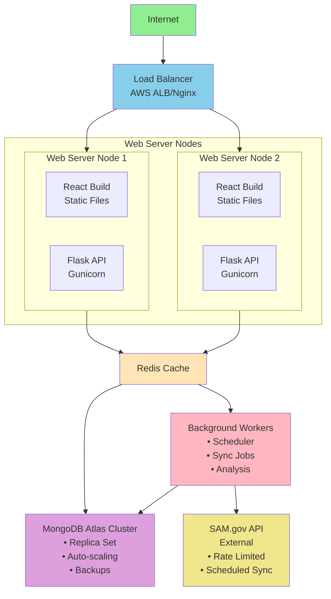
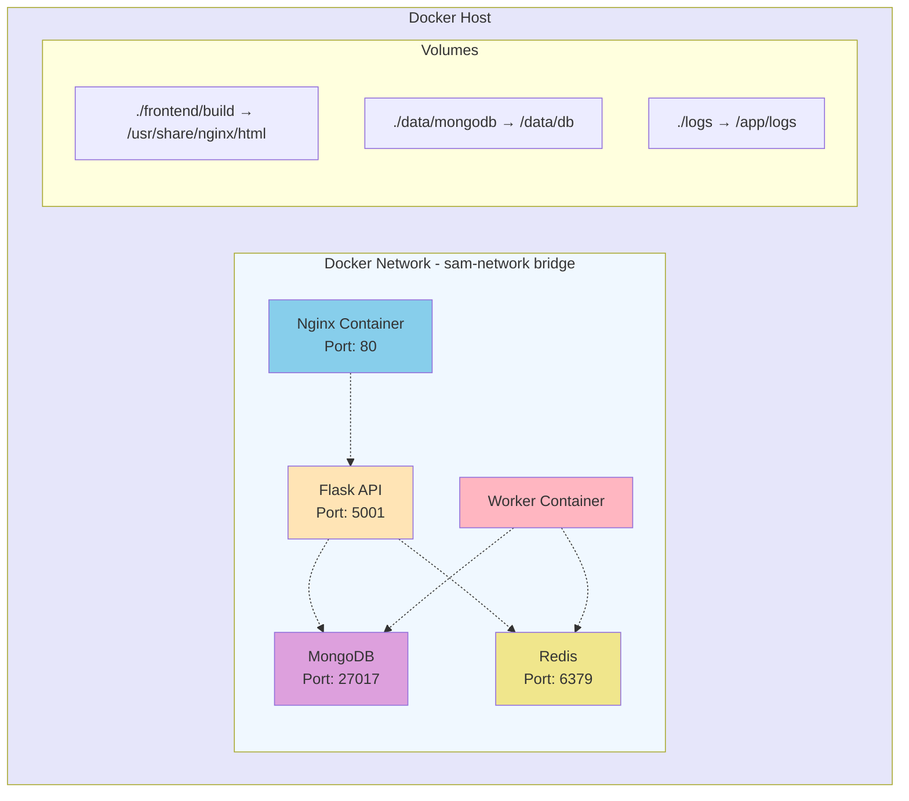
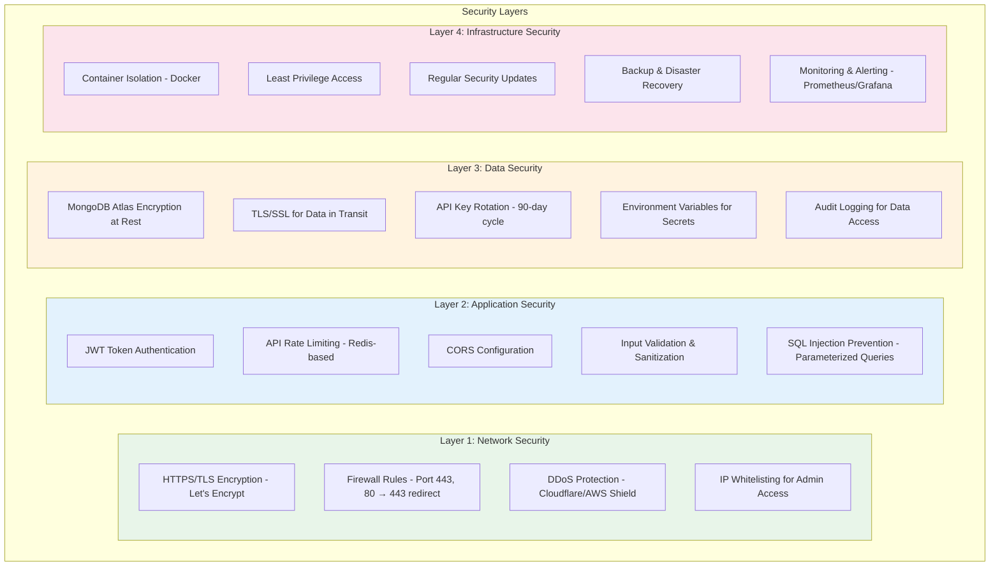
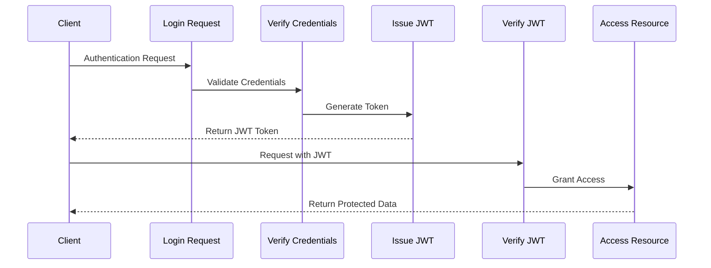

# SAM.gov Opportunity Analysis System V2
[](https://github.com/MindPetal/sam-search/actions/workflows/sam-search-build.yaml) [](https://github.com/MindPetal/sam-search/actions/workflows/sam-search-run.yaml)

A comprehensive system for searching, storing, and analyzing government contracting opportunities from SAM.gov with capability matching and frontend interface.

## Features

- **MongoDB Storage**: Stores all opportunities locally for faster access and historical analysis
- **Capability Management**: Define your organization's capabilities with keywords, NAICS codes, and preferred agencies
- **Intelligent Matching**: Automatically matches opportunities to your capabilities with percentage scores
- **Web Interface**: React-based frontend for easy opportunity browsing and analysis
- **RESTful API**: Flask backend providing data access and analysis endpoints

## System Architecture

### High-Level Architecture



### Component Interaction Diagram



## Functional Flow Diagrams

### 1. Opportunity Sync Flow



### 2. Capability Matching Flow



### 3. User Interaction Flow



### 4. Data Processing Pipeline



## Prerequisites

- Python 3.8+
- MongoDB Atlas account (configured - see MongoDB Atlas Setup below)
- Node.js 14+ and npm
- SAM.gov API Key (get from https://sam.gov/apis)

## Deployment Architecture

### Production Deployment



### Container Architecture (Docker)



## Installation

### 1. Install Python Dependencies

```bash
pip install -r requirements.txt
```

### 2. MongoDB Atlas Setup

The system is pre-configured to use MongoDB Atlas. The connection details are already set in `config_db.py`:

```python
# Connection is already configured in the code
# Database: sam_opportunities
# Collections: opportunities, capabilities, matches
```

**Important Security Note:** 
- Make sure your IP address is whitelisted in MongoDB Atlas Network Access settings
- Go to your MongoDB Atlas dashboard → Network Access → Add IP Address
- You can add your current IP or allow access from anywhere (0.0.0.0/0) for development

To test the connection:
```bash
python test_mongodb_atlas.py
```

### 3. Install Frontend Dependencies

```bash
cd frontend
npm install
cd ..
```

## Security Architecture



### Authentication & Authorization Flow



## Configuration

1. The existing `config.yaml` file contains NAICS codes and agency mappings
2. Set your SAM.gov API key as an environment variable:
   ```bash
   export SAM_API_KEY="your-api-key-here"
   ```

## Usage

### 1. Verify MongoDB Atlas Connection

Test that you can connect to MongoDB Atlas:
```bash
python test_mongodb_atlas.py
```

### 2. Fetch and Store Opportunities

Run the search script to fetch opportunities from SAM.gov and store in MongoDB Atlas:

```bash
python search_db.py $SAM_API_KEY
```

The script will automatically connect to your MongoDB Atlas cluster.

### 3. Start the Backend API

```bash
python app.py
```

The API will run on http://localhost:5001

### 4. Start the Frontend

In a new terminal:
```bash
cd frontend
npm start
```

The frontend will run on http://localhost:3000

## API Endpoints

### Opportunities
- `GET /api/opportunities` - List opportunities with filters
- `GET /api/opportunities/:id` - Get single opportunity with matches
- `POST /api/opportunities/:id/analyze` - Analyze opportunity against capabilities

### Capabilities
- `GET /api/capabilities` - List all capabilities
- `POST /api/capabilities` - Create new capability
- `PUT /api/capabilities/:id` - Update capability

### Matches
- `GET /api/matches/high` - Get high-scoring matches

### Statistics
- `GET /api/statistics` - Get system statistics

## Frontend Features

### Dashboard
- Overview of total opportunities, capabilities, and matches
- Recent high-scoring matches
- Quick statistics

### Opportunities Page
- Browse all opportunities
- Filter by NAICS, agency, set-aside, and date range
- Quick analysis button for each opportunity
- Direct links to SAM.gov

### Capability Manager
- Create and manage organizational capabilities
- Define keywords, NAICS codes, and preferred agencies
- Activate/deactivate capabilities

### High Matches
- View opportunities with highest capability match scores
- Adjustable threshold filtering
- Detailed match information

## Capability Matching Algorithm

The system scores opportunities against capabilities based on:

1. **Keyword Matching (40%)**: Keywords found in opportunity title/description
2. **NAICS Code Match (30%)**: Exact NAICS code matches
3. **Agency Preference (20%)**: Preferred agency matches
4. **Set-Aside Match (10%)**: Preferred set-aside type matches

## Scheduling Automated Searches

To automatically fetch new opportunities daily, add to crontab:

```bash
# Run daily at 6 AM
0 6 * * * /usr/bin/python3 /path/to/search_db.py $SAM_API_KEY
```

Or use the existing GitHub Actions workflow by modifying `.github/workflows/` files.

## Database Schema

### Opportunities Collection
```javascript
{
  _id: ObjectId,
  title: String,
  agency: String,
  posted_date: String,
  due_date: String,
  type: String,
  set_aside: String,
  naics: String,
  url: String,
  posted_date_parsed: Date,
  due_date_parsed: Date,
  raw_data: Object,
  created_at: Date,
  last_updated: Date
}
```

### Capabilities Collection
```javascript
{
  _id: ObjectId,
  name: String,
  description: String,
  keywords: [String],
  naics_codes: [String],
  preferred_agencies: [String],
  preferred_set_asides: [String],
  active: Boolean,
  created_at: Date,
  updated_at: Date
}
```

### Matches Collection
```javascript
{
  _id: ObjectId,
  opportunity_id: String,
  capability_id: String,
  match_percentage: Number,
  match_details: Object,
  created_at: Date
}
```

## Legacy MS Teams Integration

The original version posted opportunities to MS Teams. This functionality is preserved in `search.py`:

```bash
python3 search.py my-sam-api-key my-ms-webhook-url
```

For MS Teams webhook setup, see: [Create incoming webhooks with Workflows for Microsoft Teams](https://support.microsoft.com/en-us/office/create-incoming-webhooks-with-workflows-for-microsoft-teams-8ae491c7-0394-4861-ba59-055e33f75498)

## Troubleshooting

### MongoDB Atlas Connection Issues
- Ensure your IP is whitelisted in MongoDB Atlas Network Access
- Verify credentials in config_db.py are correct
- Run `python test_mongodb_atlas.py` to diagnose connection issues
- Check that your cluster is active in MongoDB Atlas dashboard

### Frontend Not Loading
- Check that backend is running on port 5001
- Verify proxy setting in frontend/package.json
- Clear browser cache

### No Opportunities Found
- Verify SAM.gov API key is valid
- Check date ranges in config.yaml
- Ensure NAICS codes are current

## Development

### Running Tests
```bash
python test_search.py
```

### Building for Production
```bash
cd frontend
npm run build
```

The built files will be in `frontend/build/` and served by Flask in production.

## Enhanced Version Available

For advanced features including AI chatbot, CRM workflow, and GraphRAG, see `README_ENHANCED.md`.

## License

See LICENSE file in the repository.

## Support

For issues or questions, please create an issue in the GitHub repository.
