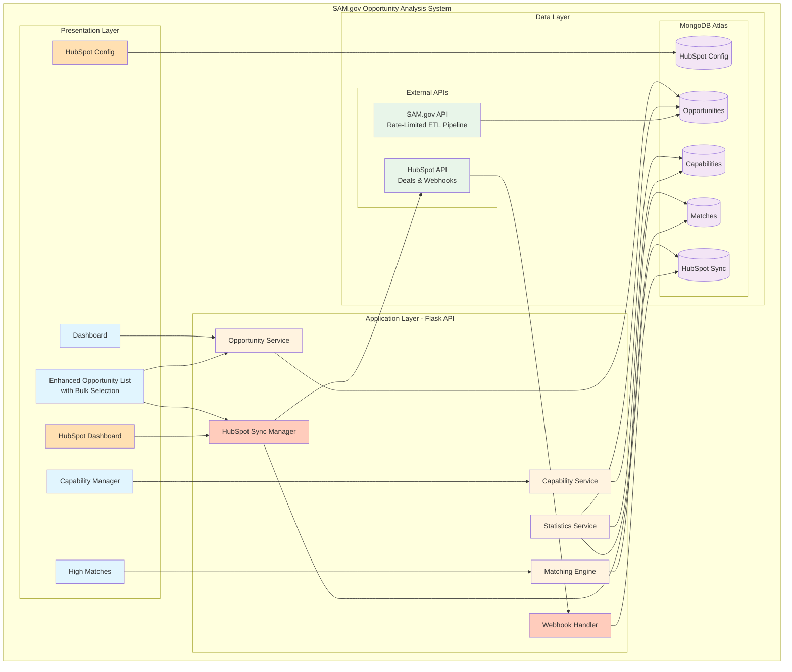
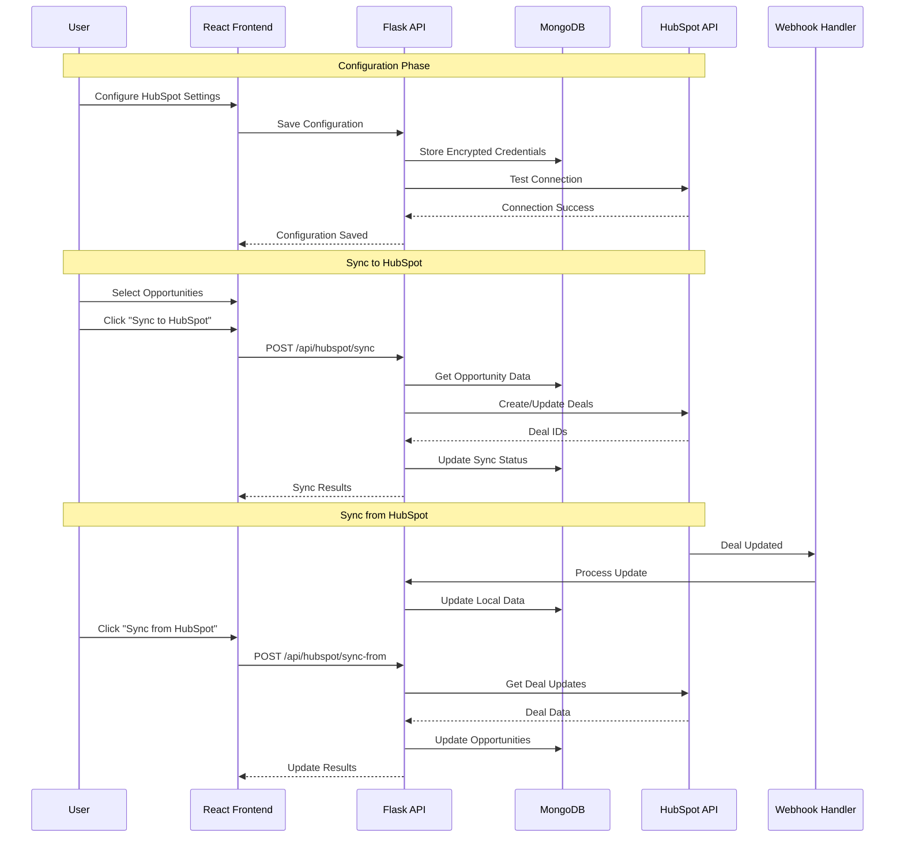

# SAM.gov Opportunity Analysis System with HubSpot Integration
[](https://github.com/MindPetal/sam-search/actions/workflows/sam-search-build.yaml) [](https://github.com/MindPetal/sam-search/actions/workflows/sam-search-run.yaml)

A comprehensive system for searching, storing, and analyzing government contracting opportunities from SAM.gov with capability matching, HubSpot CRM integration, and full-featured web interface.

## 🚀 Key Features

### Core Functionality
- **MongoDB Storage**: Stores all opportunities locally for faster access and historical analysis
- **Capability Management**: Define your organization's capabilities with keywords, NAICS codes, and preferred agencies
- **Intelligent Matching**: Automatically matches opportunities to your capabilities with percentage scores
- **Web Interface**: React-based frontend for easy opportunity browsing and analysis
- **RESTful API**: Flask backend providing data access and analysis endpoints

### 🆕 HubSpot Integration Features
- **Bidirectional Sync**: Push opportunities to HubSpot as Deals and pull updates back
- **Bulk Operations**: Select multiple opportunities for batch synchronization
- **Configuration UI**: User-friendly interface to configure HubSpot connection settings
- **Real-time Updates**: Webhook support for instant deal updates from HubSpot
- **Sync Status Tracking**: Visual indicators showing sync status for each opportunity
- **Statistics Dashboard**: Monitor sync performance, success rates, and activity logs
- **Secure Credential Storage**: Encrypted storage of API keys and sensitive configuration

## System Architecture

### High-Level Architecture with HubSpot Integration



### HubSpot Integration Flow



## Prerequisites

- Python 3.8+
- MongoDB Atlas account (configured - see MongoDB Atlas Setup below)
- Node.js 14+ and npm
- SAM.gov API Key (get from https://sam.gov/apis)
- HubSpot Account with API access (for HubSpot features)

## Installation

### 1. Install Python Dependencies

```bash
pip install -r requirements.txt
```

### 2. MongoDB Atlas Setup

The system is pre-configured to use MongoDB Atlas. The connection details are already set in `config_db.py`:

```python
# Connection is already configured in the code
# Database: sam_opportunities
# Collections: opportunities, capabilities, matches, hubspot_sync, hubspot_config
```

**Important Security Note:** 
- Make sure your IP address is whitelisted in MongoDB Atlas Network Access settings
- Go to your MongoDB Atlas dashboard → Network Access → Add IP Address
- You can add your current IP or allow access from anywhere (0.0.0.0/0) for development

To test the connection:
```bash
python test_mongodb_atlas.py
```

### 3. Install Frontend Dependencies

```bash
cd frontend
npm install
cd ..
```

### 4. HubSpot Setup (Optional)

#### Create Custom Properties in HubSpot
Navigate to HubSpot Settings → Properties → Deal Properties and create:
- `sam_opportunity_id` (Single-line text)
- `sam_notice_id` (Single-line text)
- `sam_agency` (Single-line text)
- `sam_naics` (Single-line text)
- `sam_set_aside` (Single-line text)
- `sam_url` (URL)
- `sam_posted_date` (Date picker)

#### Get API Credentials (Private App Access Token)
1. Go to HubSpot Settings → Integrations → Private Apps
2. Click "Create a private app" (or use existing)
3. Name your app (e.g., "SAM.gov Integration")
4. In the Scopes tab, grant these permissions:
   - `crm.objects.deals.read`
   - `crm.objects.deals.write`
5. Create/Save the app
6. Copy the Access Token (starts with `pat-na1-` or similar)

**Important:** HubSpot API Keys are deprecated. You must use a Private App Access Token.

## Configuration

1. Set your SAM.gov API key as an environment variable:
   ```bash
   export SAM_API_KEY="your-api-key-here"
   ```

2. Configure HubSpot through the UI:
   - Start the application
   - Navigate to `/hubspot-config`
   - Enter your API credentials
   - Configure sync settings
   - Test the connection

## Usage

### 1. Start the Backend API

```bash
python app.py
```

The API will run on http://localhost:5001

### 2. Start the Frontend

In a new terminal:
```bash
cd frontend
npm start
```

The frontend will run on http://localhost:3000

### 3. Fetch and Store Opportunities

Run the search script to fetch opportunities from SAM.gov:

```bash
python search_db.py $SAM_API_KEY
```

### 4. Using HubSpot Integration

#### Configure HubSpot
1. Navigate to `/hubspot-config`
2. Enter your API credentials
3. Configure sync settings
4. Click "Test Connection" to verify

#### Sync Opportunities to HubSpot
1. Go to `/opportunities`
2. Select opportunities using checkboxes
3. Click "Sync to HubSpot"
4. Monitor sync status badges

#### Pull Updates from HubSpot
1. Click "Sync from HubSpot" on the opportunities page
2. Or set up webhooks for real-time updates

#### Monitor Sync Status
1. Navigate to `/hubspot` for the dashboard
2. View statistics, success rates, and activity logs
3. Check individual opportunity sync status on the list page

## API Endpoints

### Opportunities
- `GET /api/opportunities` - List opportunities with filters
- `GET /api/opportunities/:id` - Get single opportunity with matches
- `GET /api/opportunities/with-sync` - Get opportunities with HubSpot sync status
- `POST /api/opportunities/:id/analyze` - Analyze opportunity against capabilities

### Capabilities
- `GET /api/capabilities` - List all capabilities
- `POST /api/capabilities` - Create new capability
- `PUT /api/capabilities/:id` - Update capability

### Matches
- `GET /api/matches/high` - Get high-scoring matches

### Statistics
- `GET /api/statistics` - Get system statistics

### HubSpot Integration
- `GET /api/hubspot/config` - Get HubSpot configuration
- `POST /api/hubspot/config` - Save HubSpot configuration
- `POST /api/hubspot/test` - Test HubSpot connection
- `POST /api/hubspot/sync` - Sync opportunities to HubSpot
- `POST /api/hubspot/sync-from` - Pull updates from HubSpot
- `GET /api/hubspot/statistics` - Get HubSpot sync statistics
- `POST /api/hubspot/webhook` - Receive HubSpot webhook events

## Frontend Features

### Dashboard
- Overview of total opportunities, capabilities, and matches
- Recent high-scoring matches
- Quick statistics

### Enhanced Opportunities Page
- Browse all opportunities with HubSpot sync status
- **Bulk selection with checkboxes**
- **Sync selected opportunities to HubSpot**
- **Visual sync status indicators**
- Filter by NAICS, agency, set-aside, and date range
- Quick analysis button for each opportunity
- Direct links to SAM.gov

### HubSpot Configuration
- User-friendly configuration interface
- Secure credential management
- Connection testing
- Sync settings customization

### HubSpot Dashboard
- Real-time sync statistics
- Success/failure rates
- Activity logs
- Performance monitoring

### Capability Manager
- Create and manage organizational capabilities
- Define keywords, NAICS codes, and preferred agencies
- Activate/deactivate capabilities

### High Matches
- View opportunities with highest capability match scores
- Adjustable threshold filtering
- Detailed match information

## Capability Matching Algorithm

The system scores opportunities against capabilities based on:

1. **Keyword Matching (40%)**: Keywords found in opportunity title/description
2. **NAICS Code Match (30%)**: Exact NAICS code matches
3. **Agency Preference (20%)**: Preferred agency matches
4. **Set-Aside Match (10%)**: Preferred set-aside type matches

## Security Features

### HubSpot Integration Security
- **Encrypted Credentials**: API keys stored using Fernet encryption
- **Webhook Validation**: HMAC signature verification for webhooks
- **Secure Configuration**: Sensitive data never exposed in UI
- **Access Control**: Configuration requires proper authentication

### General Security
- MongoDB Atlas encryption at rest and in transit
- Environment variables for sensitive configuration
- CORS protection for API endpoints
- Input validation and sanitization

## Database Schema

### Opportunities Collection
```javascript
{
  _id: ObjectId,
  title: String,
  agency: String,
  posted_date: String,
  due_date: String,
  type: String,
  set_aside: String,
  naics: String,
  url: String,
  status: String, // 'open', 'won', 'lost'
  posted_date_parsed: Date,
  due_date_parsed: Date,
  raw_data: Object,
  created_at: Date,
  last_updated: Date
}
```

### HubSpot Sync Collection
```javascript
{
  _id: ObjectId,
  opportunity_id: String,
  hubspot_deal_id: String,
  sync_status: String, // 'created', 'updated', 'error', 'deleted'
  last_sync: Date,
  last_sync_from_hubspot: Date,
  sync_error: String,
  webhook_data: Object,
  hubspot_data: Object,
  updated_at: Date
}
```

### HubSpot Config Collection
```javascript
{
  _id: "hubspot_config",
  api_key_encrypted: String,
  access_token_encrypted: String,
  pipeline_id: String,
  default_stage_id: String,
  sync_enabled: Boolean,
  sync_interval_minutes: Number,
  webhook_enabled: Boolean,
  webhook_url: String,
  custom_field_mappings: Object,
  updated_at: Date
}
```

## Scheduling and Automation

### Automated Opportunity Fetching
Add to crontab for daily updates:
```bash
# Run daily at 6 AM
0 6 * * * /usr/bin/python3 /path/to/search_db.py $SAM_API_KEY
```

### Automated HubSpot Sync
Set up a scheduled job for regular synchronization:
```bash
# Sync to HubSpot every 30 minutes
*/30 * * * * curl -X POST http://localhost:5001/api/hubspot/sync-from
```

## Troubleshooting

### HubSpot Integration Issues
- **Connection Failed**: Verify API credentials and network connectivity
- **Sync Errors**: Check HubSpot API limits and custom property existence
- **Webhook Not Working**: Ensure webhook URL is publicly accessible
- **Missing Sync Status**: Refresh the page or manually sync from HubSpot

### MongoDB Atlas Connection Issues
- Ensure your IP is whitelisted in MongoDB Atlas Network Access
- Verify credentials in config_db.py are correct
- Run `python test_mongodb_atlas.py` to diagnose connection issues

### Frontend Not Loading
- Check that backend is running on port 5001
- Verify proxy setting in frontend/package.json
- Clear browser cache

## Development

### Running Tests
```bash
python test_backend.py
python test_search.py
```

### Building for Production
```bash
cd frontend
npm run build
```

The built files will be in `frontend/build/` and can be served by Flask in production.

## Docker Deployment

```bash
# Build and run with Docker Compose
docker-compose up -d

# View logs
docker-compose logs -f

# Stop services
docker-compose down
```

## Performance Optimization

### HubSpot Sync Best Practices
- Start with small batches for initial testing
- Use bulk operations for large datasets
- Monitor API rate limits (HubSpot has usage quotas)
- Enable webhooks for real-time updates instead of polling

### Database Optimization
- Indexes are automatically created for common queries
- Regular cleanup of old sync records recommended
- Consider archiving old opportunities periodically

## Support and Documentation

- For HubSpot integration details, see `HUBSPOT_INTEGRATION.md`
- For advanced features (AI chatbot, GraphRAG), see `README_ENHANCED.md`
- For issues or questions, create an issue in the GitHub repository

## License

See LICENSE file in the repository.

## Contributors

- Original SAM.gov integration
- Enhanced with HubSpot CRM integration
- MongoDB Atlas cloud database support
- React frontend with modern UI/UX

---

**Latest Update**: Added comprehensive HubSpot integration with bidirectional sync, bulk operations, and real-time webhook support.